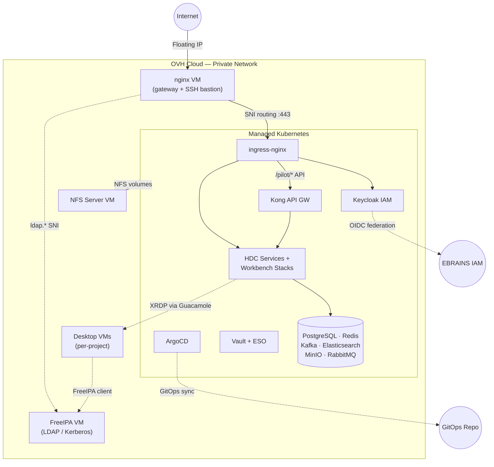
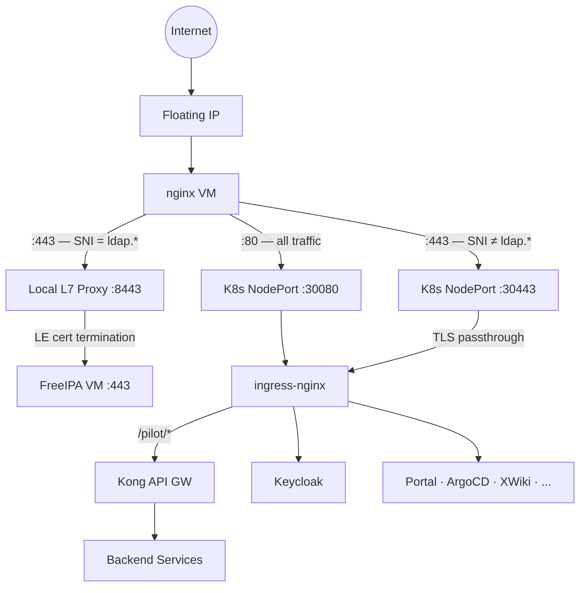

# Architecture

Infrastructure for the Pilot HDC platform on OVH Cloud. This repository manages the **infrastructure layer** (Terraform + Ansible). Kubernetes workloads are deployed via GitOps from [pilot-hdc-platform-gitops](https://github.com/PilotDataPlatform/pilot-hdc-platform-gitops/).

## Overview

## Network

All resources share a single OVH **private network** with DHCP. No VM has a public IP except the nginx gateway.

| Component | Role |
|---|---|
| **Private network** | Single subnet connecting all VMs and K8s nodes |
| **Gateway** | OVH managed gateway providing internet egress for private VMs |
| **Floating IP** | Single public IP attached to the nginx VM — the only entry point for all external traffic |

## Traffic Flow & SNI Routing

### SNI Routing

nginx uses the TLS **Server Name Indication** header to route port 443 traffic *without terminating TLS*:

- **`ldap.*`** — forwarded to a local L7 reverse proxy (port 8443) that terminates TLS with a Let's Encrypt certificate (certbot on the nginx VM), then proxies to FreeIPA. This gives FreeIPA a trusted certificate and web UI access without a public IP or a second load balancer.
- **Everything else** — passed through to K8s ingress-nginx (NodePort 30443), which handles TLS termination via cert-manager.

Port 80 is proxied to K8s (NodePort 30080) for HTTP-to-HTTPS redirects and ACME challenges.

## Virtual Machines

| VM | Role | OS | Block Storage |
|---|---|---|---|
| **nginx** | Public gateway, SNI routing, SSH bastion | Ubuntu 24.04 | -- |
| **nfs** | NFS file server for K8s RWX volumes | Ubuntu 24.04 | 50 GB at `/nfs/export` |
| **freeipa** | LDAP/Kerberos identity server (runs as Docker container) | Ubuntu 24.04 | 20 GB at `/srv/freeipa-data` |
| **guacamole** (per-project) | Remote desktop VMs: XFCE4, XRDP, FreeIPA client, Singularity, scientific tools | Ubuntu 22.04 | 50 GB at `/data01` |

All VMs use SSH key auth on a non-standard port (post-hardening). The nginx VM doubles as SSH bastion for reaching private VMs via `ProxyCommand`.

## Kubernetes Cluster

OVH Managed Kubernetes with a single node pool, attached to the private network. Nodes use private network routing as default, with individual public IPs for egress.

### Platform Services

Deployed from [pilot-hdc-platform-gitops](https://github.com/PilotDataPlatform/pilot-hdc-platform-gitops/) using ArgoCD's app-of-apps pattern.

| Category | Services |
|---|---|
| **Ingress & TLS** | ingress-nginx (NodePort 30080/30443), cert-manager (Let's Encrypt) |
| **GitOps** | ArgoCD (self-managing) |
| **Secrets** | HashiCorp Vault, External Secrets Operator (syncs Vault secrets to K8s Secrets) |
| **API Gateway** | Kong with OIDC + CORS plugins, routes API paths to backend services |
| **Identity** | Keycloak with EBRAINS IAM federation, per-service OIDC clients, per-project auth flows |
| **Data Stores** | PostgreSQL, Redis, Kafka + Zookeeper, Elasticsearch, MinIO (S3), RabbitMQ |
| **Storage** | NFS subdir provisioner (`nfs-client` StorageClass backed by the NFS server VM) |
| **CI Runners** | GitHub Actions Runner Controller (ARC) for self-hosted runners |

### Application Services

HDC platform microservices (auth, metadata, project, dataset, BFF, portal, etc.) and per-project workbench stacks (Guacamole, JupyterHub, Superset) are defined in the [gitops repository](https://github.com/PilotDataPlatform/pilot-hdc-platform-gitops/). Workbench stacks use ArgoCD ApplicationSets to deploy one instance per project.

### Keycloak IAM (Terraform-managed)

Keycloak realm and OIDC client configuration is managed in `terraform/keycloak/`:

- Realm `hdc` with EBRAINS IAM as federated identity provider
- OIDC clients for each platform service (Portal, Kong, XWiki, CLI, per-project Guacamole/Superset/JupyterHub)
- Per-project authentication flows with group-based access control

### Kong API Gateway (Terraform-managed)

Kong routes and plugins are managed in `terraform/kong/`:

- 8 routes mapping API paths to backend K8s services
- OIDC plugin for bearer token validation via Keycloak
- CORS plugin per route

Kong's Terraform module requires `kubectl port-forward` to the Kong Admin API and is applied manually (not in CI).

## IaC Mapping

| Component | Tool | Files |
|---|---|---|
| Private network + subnet | Terraform | `terraform/network.tf` |
| Gateway (egress) | Terraform | `terraform/gateway.tf` |
| nginx VM + floating IP | Terraform | `terraform/instance.tf` |
| K8s cluster + node pool | Terraform | `terraform/kubernetes.tf` |
| NFS server VM + volume | Terraform | `terraform/nfs.tf` |
| FreeIPA VM + volume | Terraform | `terraform/freeipa.tf` |
| Guacamole desktop VMs | Terraform | `terraform/guacamole.tf` |
| Keycloak realm + clients | Terraform | `terraform/keycloak/*.tf` |
| Kong routes + plugins | Terraform | `terraform/kong/*.tf` |
| nginx SNI routing | Ansible | `ansible/playbooks/nginx-stream-passthrough.yml` |
| Certbot (LE certs for FreeIPA) | Ansible | `ansible/playbooks/certbot-setup.yml` |
| NFS server setup | Ansible | `ansible/playbooks/nfs-server.yml` |
| FreeIPA server setup | Ansible | `ansible/playbooks/freeipa-server.yml` |
| Guacamole VM provisioning | Ansible | `ansible/playbooks/guacamole-vm.yml` |
| SSH hardening (all VMs) | Ansible | `ansible/playbooks/ssh-hardening.yml` |
| DNS resolvers (all VMs) | Ansible | `ansible/playbooks/dns-setup.yml` |
| ArgoCD bootstrap | Ansible | `ansible/playbooks/argocd-bootstrap.yml` |
| Orchestration (all playbooks) | Ansible | `ansible/playbooks/site.yml` |
| K8s workloads | ArgoCD | [pilot-hdc-platform-gitops](https://github.com/PilotDataPlatform/pilot-hdc-platform-gitops/) |

## Secrets Management

All secrets are encrypted at rest using [SOPS](https://github.com/getsops/sops) with [age](https://age-encryption.org/) keys. See [`.sops.yaml`](../.sops.yaml) for encryption rules and key recipients.

## CI/CD

- **PR checks** ([`terraform-lint.yml`](../.github/workflows/terraform-lint.yml)): gitleaks secret scan, `terraform fmt`, `terraform validate`, tflint, checkov
- **Deploy dev** ([`terraform-deploy.yml`](../.github/workflows/terraform-deploy.yml)): runs `plan` + `apply` for infra and keycloak modules on push to `main` (path-filtered to `terraform/`)
- **Deploy prod** (same workflow, `workflow_dispatch`): manual trigger with `deploy_prod` flag, `environment: prod` protection, infra module only

Self-hosted GitHub Actions runners (ARC) run inside the K8s cluster for CI jobs across the [PilotDataPlatform](https://github.com/PilotDataPlatform) organization.
